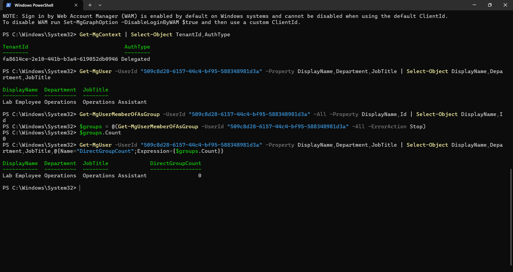

# Identity reporting with Microsoft Graph PowerShell

A read-only PowerShell lab that reports an employee's profile and direct group memberships in Microsoft Entra ID. The script distinguishes a valid zero-membership result from a failed user lookup and saves a dated text report after successful queries.

## Skills demonstrated

- Microsoft Graph delegated authentication and read permissions.
- Reading user profiles and direct group memberships with PowerShell.
- Reusing a script for different users through parameters.
- Retrieving all membership pages and stopping on query errors.
- Recording results, timestamps, evidence and testing limitations.
- Processing multiple users with foreach and recording failures with try/catch.

## Verified tests

Tests were performed in a personal learning tenant on 25 September 2026 using fictional users.

| Test | Observed result | Evidence |
| --- | --- | --- |
| Lab Employee | Operations / Operations Assistant; 0 direct groups returned | [Saved report](evidence/lab-employee-report.txt) |
| Review HR | HR / HR Assistant; 1 direct group, LAB-HR-Review | [Saved report](evidence/review-hr-report.txt) |
| Nonexistent user ID | HTTP 404, Request_ResourceNotFound; script stopped and no new report was found | [Test record](evidence/invalid-user-test.md) |

The script was syntax-checked. Both successful report files were inspected, and the reports folder was checked after the invalid-user test. Other failure paths have not been tested live.

## Batch reporting extension

The [batch reporting walkthrough](BATCH-REPORTING.md) includes the tested loop and evidence for processing two valid users with an invalid ID between them. The failed lookup was recorded, processing continued to Review HR, and the failure details were saved to a text file. This extension uses the original script unchanged and was tested interactively.

## How the single-user script works

1. Uses an existing Microsoft Graph connection and checks that it belongs to the expected lab tenant.
2. Reads the selected user's name, department and job title.
3. Retrieves direct group memberships with `-All`.
4. Stops if either query fails, before writing a report.
5. Saves the results, group names and IDs, and UTC collection time to a uniquely named text file in `reports`.

## Run the lab script

Requirements: PowerShell 7, Microsoft.Graph.Users and its authentication dependency, and a Graph connection with the appropriate read permissions. Microsoft.Graph.Users 2.40.0 was used in this lab. The connection requested `User.Read.All` and `GroupMember.Read.All` with `ContextScope Process`.

From this folder in the connected PowerShell 7 session:

```powershell
# Default lab employee
.\Get-LabEmployeeReport.ps1

# Review HR
.\Get-LabEmployeeReport.ps1 -UserId '252af843-34f0-4b48-bffa-7bd64e458d28'

# Expected failure: nonexistent user
.\Get-LabEmployeeReport.ps1 -UserId '00000000-0000-0000-0000-000000000000'
```

This is the exact tested lab script. Its default user ID and tenant check are specific to this personal lab. To adapt it to another tenant, change the expected tenant ID and supply a user ID from that tenant. Authentication is performed separately; the script does not collect credentials or grant consent.

## Screenshot

This screenshot shows the earlier interactive commands, connection context, profile lookup and zero-membership result. It is not a screenshot of the later script runs.



## What I learned

The PowerShell session matters: after initially using Windows PowerShell 5.1, I switched to PowerShell 7, verified the Users module and connected there. A department value describes a user profile; it does not itself prove access. A successful query returning no memberships is different from a failed lookup, which should stop report generation.

## Scope and limitations

This exercise reads profiles and direct memberships without changing accounts or groups. It does not assess effective access, application assignments, administrative roles, resource permissions or transitive memberships. Profile and membership queries occur sequentially rather than as one atomic snapshot. The lab identifiers retained in the script and evidence identify test objects; no passwords, access tokens or device sign-in codes are included.
